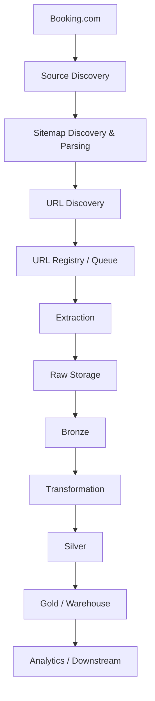

# Booking Data Pipeline — Architecture

## 1. Architecture Goals

- **Raw data preservation**: Architecture phải bảo toàn raw data để pipeline có thể reprocess dữ liệu mà không cần crawl lại source.
- **Idempotency**: Pipeline phải có khả năng chạy lại mà không tạo ra dữ liệu trùng lặp.
- **Separation of concerns**: Mỗi component nên có một responsibility rõ ràng và có thể thay đổi tương đối độc lập.
- **Testability**: Các component quan trọng phải được thiết kế để có thể kiểm thử độc lập.
- **Observability**: Pipeline phải cung cấp đủ logging và metrics để theo dõi trạng thái, xử lý và xác định failure.

## 2. High-Level Architecture

```text
Source (booking.com)
    │
    ▼
Source Discovery
    │  Xác định resource nào cần xử lý
    ▼
URL Registry
    │  Xác định trạng thái của một URL:
    │   - Đã thấy chưa?
    │   - Đã crawl chưa?
    │   - Lần cuối thấy là khi nào?
    │   - Trạng thái hiện tại của URL?
    ▼
Extraction
    │  Lấy dữ liệu từ resource
    │  Biến source resource thành raw data mà pipeline có thể lưu lại
    ▼
Raw Storage
    │  Raw data được bảo toàn để reprocess
    ▼
Source Representation
    ├── Bronze = Raw data organized for processing
    ├── Silver = Cleaned / normalized data
    └── Gold   = Business / analytics-ready data
    │
    ▼
Consumers
```

## 3. Component Responsibilities

| Component | Responsibility | Does Not Handle |
|---|---|---|
| Source Discovery | Discover available data sources and source entry points | Data extraction |
| URL Discovery | Discover URLs belonging to target entities/resources | Data transformation |
| URL Registry | Track discovered URLs and crawling state | Parsing hotel data |
| Extraction | Extract raw data from discovered sources | Business analytics |
| Raw Storage | Preserve original extracted data for replay and reprocessing | Data cleaning |
| Bronze | Organize raw data into a processable structure | Business-level transformations |
| Transformation | Transform data between processing layers | Source discovery |
| Silver | Clean, normalize, validate and deduplicate data | Analytics presentation |
| Gold | Produce analytics-ready datasets | Raw extraction |
| Analytics / Downstream | Consume Gold data for analytics, reporting or recommendation | Core data collection |

## 4. Data Flow

### 4.1. Source Discovery

**Input:**
- Booking.com
- Source configuration
- Known sitemap information
- `robots.txt` where applicable

**Process:**
- Identify available data sources and source entry points.
- Discover sitemap locations.
- Determine which source should be processed.

**Output:**
- Discovered source information
- Sitemap URLs / source entry points

### 4.2. Sitemap Discovery & Parsing

**Input:**
- Discovered sitemap URL

**Process:**
- Fetch sitemap XML.
- Parse XML content.
- Determine whether the document is a sitemap URL set or sitemap index.
- Convert XML into structured models.

**Output:**
- `Sitemap`
- `SitemapIndex`
- Sitemap entries / URLs

### 4.3. URL Discovery

**Input:**
- Parsed sitemap
- Sitemap index entries

**Process:**
- Extract URLs from sitemap data.
- Normalize discovered URLs.
- Identify URLs belonging to target entities/resources.

**Output:**
- Candidate URLs
- URL metadata

### 4.4. URL Registry / Queue

**Input:**
- Candidate URLs

**Process:**
- Track discovered URLs.
- Identify URL status.
- Prevent uncontrolled duplicate processing.
- Track crawling / processing state.

**Output:**
- URLs ready for extraction
- URL processing metadata

### 4.5. Extraction

**Input:**
- URLs ready for extraction

**Process:**
- Fetch target resources.
- Extract raw data from web / API / GraphQL-like endpoints where applicable.
- Capture extraction metadata.
- Handle request failures and retries.

**Output:**
- Raw extracted data
- Extraction metadata

### 4.6. Raw Storage

**Input:**
- Raw extracted data
- Extraction metadata

**Process:**
- Persist the original extracted data.
- Preserve source data without destructive modification.
- Organize data by ingestion / extraction time or suitable partitions.

**Output:**
- Immutable raw datasets

### 4.7. Bronze

**Input:**
- Raw datasets

**Process:**
- Organize raw data into a processable structure.
- Preserve data close to the original source representation.
- Add required ingestion metadata where appropriate.

**Output:**
- Bronze datasets

### 4.8. Transformation → Silver

**Input:**
- Bronze datasets

**Process:**
- Clean data.
- Normalize fields.
- Validate records.
- Deduplicate data.
- Apply transformation rules.

**Output:**
- Silver datasets

### 4.9. Silver → Gold / Warehouse

**Input:**
- Silver datasets

**Process:**
- Apply business-level data modeling.
- Create curated analytical datasets.
- Prepare datasets for downstream consumption.
- Load analytical structures into the warehouse where applicable.

**Output:**
- Gold datasets
- Analytics-ready tables

### 4.10. Analytics / Downstream

**Input:**
- Gold datasets
- Warehouse data

**Process:**
- Consume curated datasets.
- Support analytics, BI, reporting or future recommendation use cases.

**Output:**
- Analytical insights
- Reports / dashboards
- Datasets for downstream systems

## 5. End-to-End Data Flow


