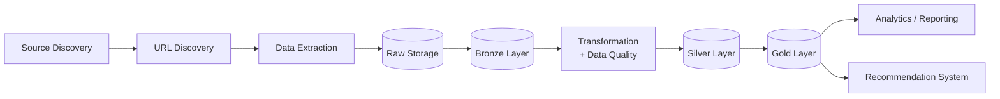

# 🏨 Booking Data Pipeline

> Batch-oriented data pipeline thu thập, lưu trữ, kiểm tra và chuẩn hóa dữ liệu khách sạn từ Booking.com, phục vụ các hệ thống phân tích và Recommendation System.

---

## 📑 Mục lục

1. [Problem Statement](#1-problem-statement)
2. [Goals](#2-goals)
3. [Scope](#3-scope)
4. [Architecture](#4-architecture)
5. [Functional Requirements](#5-functional-requirements)
6. [Non-functional Requirements](#6-non-functional-requirements)
7. [Input](#7-input)
8. [Output](#8-output)
9. [Success Criteria](#9-success-criteria)

---

## 1. Problem Statement

Dữ liệu khách sạn và thông tin du lịch nằm phân tán trên nhiều nguồn web với cấu trúc không đồng nhất. Việc thu thập bằng các script crawl đơn lẻ khó đảm bảo khả năng lưu trữ, kiểm tra, xử lý lại và sử dụng ổn định.

Project này xây dựng một **data pipeline** để thu thập dữ liệu khách sạn từ Booking.com, sau đó lưu trữ, kiểm tra, biến đổi và chuẩn hóa thành các dataset có cấu trúc. Dữ liệu đầu ra là nền tảng cho các use case downstream như:

- Hotel Analytics
- Review Analysis
- Recommendation System
- Reporting

## 2. Goals

Xây dựng một **batch-oriented hotel data pipeline** tạo ra dữ liệu:

-  Có cấu trúc
-  Có thể kiểm tra chất lượng
-  Có thể xử lý lại (reprocessable)
-  Có thể mở rộng (scalable)
-  Sẵn sàng phục vụ các hệ thống phân tích hoặc machine learning downstream

## 3. Scope

Pipeline được thiết kế theo hướng **batch processing**, bao gồm các thành phần:

| Nhóm | Thành phần |
|---|---|
| **Ingestion** | Source Discovery, URL Discovery, Hotel Data Extraction |
| **Storage** | Raw Data Storage, Bronze Layer, Silver Layer, Gold Layer |
| **Processing** | Data Transformation, Incremental Processing, Idempotent Processing, Deduplication |
| **Reliability** | Data Quality, Logging, Retry, Testing |
| **Documentation** | Pipeline Documentation |

## 4. Architecture

## 5. Functional Requirements

### 5.1. Source Discovery
Pipeline phải có khả năng xác định và discover các nguồn dữ liệu phù hợp từ Booking.com.

### 5.2. URL Discovery
Pipeline phải discover và quản lý danh sách các URL cần được xử lý.

### 5.3. Data Extraction
Pipeline phải thu thập dữ liệu khách sạn từ các URL đã xác định, bao gồm:

- Hotel information
- Location
- Room information
- Price
- Review
- Availability

### 5.4. Raw Data Storage
Pipeline phải lưu trữ dữ liệu raw **trước khi transformation** để có thể:

- Reprocess
- Debug
- Audit
- Reproduce

### 5.5. Bronze Layer
Pipeline phải tạo Bronze layer từ raw data để phục vụ các bước xử lý tiếp theo.

### 5.6. Data Transformation
Pipeline phải transform dữ liệu từ Raw/Bronze thành dữ liệu có cấu trúc và được chuẩn hóa.

### 5.7. Silver Layer
Pipeline phải tạo Silver layer chứa dữ liệu đã được **clean, normalize, validate và deduplicate**.

### 5.8. Gold Layer
Pipeline phải tạo các dataset phục vụ các use case phân tích hoặc downstream systems.

### 5.9. Incremental Processing
Pipeline phải phát hiện được dữ liệu mới hoặc dữ liệu đã thay đổi để tránh xử lý lại toàn bộ khi không cần thiết. Có thể sử dụng các metadata:

| Metadata | Mục đích |
|---|---|
| `last_crawled_at` | Thời điểm crawl gần nhất |
| `last_seen_at` | Thời điểm entity được thấy lần cuối trên source |
| `content_hash` | Phát hiện thay đổi nội dung |
| `source_updated_at` | Thời điểm source cập nhật dữ liệu |

### 5.10. Idempotent Processing
Chạy lại pipeline với cùng một input phải cho ra cùng một kết quả, không sinh dữ liệu trùng lặp hay sai lệch.

### 5.11. Deduplication
Pipeline phải hạn chế tạo duplicate data khi cùng một source hoặc entity được xử lý nhiều lần.

### 5.12. Data Quality
Pipeline phải kiểm tra các điều kiện chất lượng dữ liệu trước hoặc trong quá trình đưa dữ liệu sang layer tiếp theo.

### 5.13. Logging
Pipeline phải ghi log đủ để biết:

- Pipeline đang chạy ở bước nào
- Số record được xử lý
- Số record thất bại
- Lỗi xảy ra ở component nào
- Thời gian xử lý (processing time)

### 5.14. Retry
Các lỗi tạm thời (transient errors) trong quá trình extraction phải có cơ chế retry phù hợp.

### 5.15. Testing
Các component quan trọng của pipeline phải có thể được kiểm thử độc lập.

## 6. Non-functional Requirements

| Yêu cầu | Mô tả |
|---|---|
| **Reliability** | Lỗi ở một URL/record không làm dừng toàn bộ pipeline |
| **Maintainability** | Code chia module rõ ràng theo từng layer/component |
| **Scalability** | Có thể mở rộng thêm nguồn dữ liệu mới mà không phải viết lại pipeline |
| **Observability** | Log và metrics đủ để theo dõi và debug từng lần chạy |
| **Configurability** | Tham số (nguồn, lịch chạy, đường dẫn lưu trữ) được quản lý qua config, không hard-code |
| **Responsible Crawling** | Giới hạn tốc độ request (rate limiting), tôn trọng `robots.txt` và điều khoản sử dụng của nguồn dữ liệu |

## 7. Input

Dữ liệu được crawl từ các nguồn web, **chủ yếu là Booking.com**, có thể mở rộng sang các nguồn khác (ví dụ: Pinterest).

## 8. Output

Dữ liệu sạch, có cấu trúc, phục vụ cho **Recommendation System** và các use case phân tích downstream.

## 9. Success Criteria

- Pipeline chạy end-to-end từ Source Discovery đến Gold Layer
- Raw data được lưu trữ đầy đủ và có thể reprocess
- Chạy lại pipeline không tạo dữ liệu trùng lặp 
- Incremental run chỉ xử lý dữ liệu mới hoặc thay đổi
- Data quality checks được áp dụng giữa các layer
- Log thể hiện rõ số record thành công/thất bại và thời gian xử lý
- Các component chính có unit test
- Gold dataset sẵn sàng làm input cho Recommendation System
